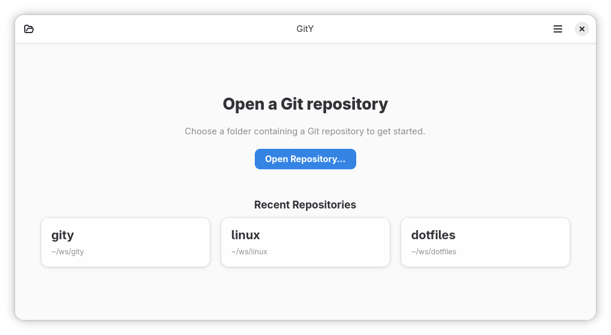
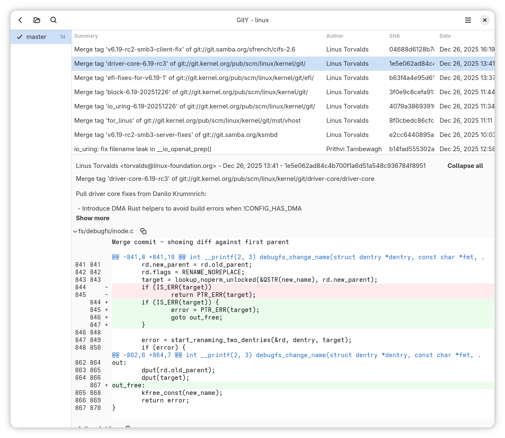

# GitY

A simple and fast Git repository browser.
View branches, commit diffs, and search through all commit messages.




## Development Setup
```bash
sudo dnf install -y gcc rust rustfmt rust-analyzer cargo gtk4-devel openssl-devel libadwaita-devel meson ninja-build gtksourceview5-devel
```

## Building

### Development Build and Run
To build and run the development version:
```bash
cargo run
```

### Release Build and Install
To build and install the release version:
```bash
./build-release.sh
```

Or to install to a custom prefix:
```bash
./build-release.sh /custom/prefix
```

This will:
- Configure a release build in `build-release/` directory
- Compile the application with optimizations
- Install to the system (requires sudo for system directories)
- Compile GSettings schemas in the install location
