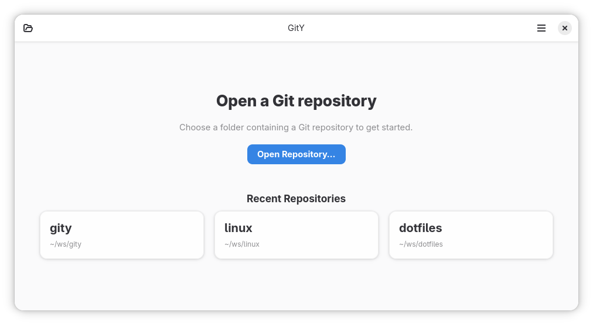
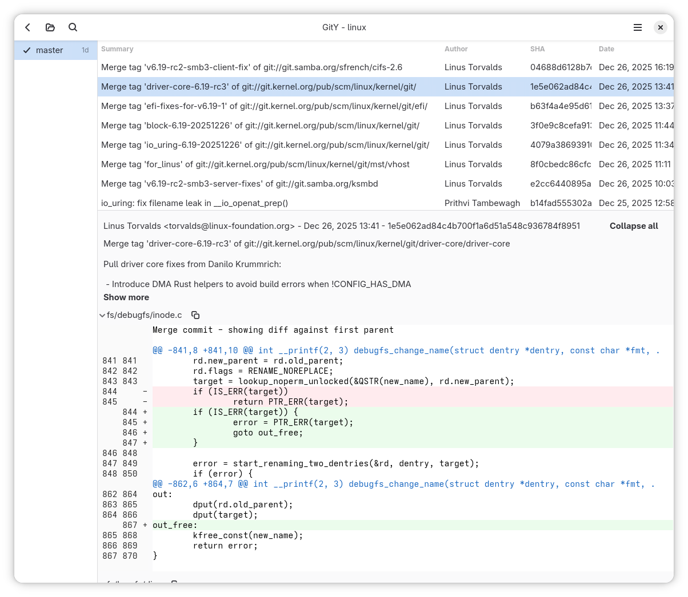

# GitY

A simple and fast Git repository browser.
View branches, commit diffs, and search through all commit messages.




## Flatpak
<a href="https://flathub.org/apps/details/com.markdeepwell.GitY">
  
</a>

## Development Setup
```bash
sudo dnf install -y gcc rust rustfmt rust-analyzer cargo gtk4-devel openssl-devel libadwaita-devel meson ninja-build gtksourceview5-devel
```

### Code Linting

This repository uses [hk](https://github.com/jdx/hk) for pre-commit checks.

Install hk (for example `cargo install hk` or your package manager), then either enable hooks (`hk install` from the repo root). Put the same `hk` binary on your `PATH` when Git runs hooks (built-in whitespace and EOF steps shell out to `hk util`), for example by adding `~/.cargo/bin` to your PATH or using a distro package.

Run the same checks without committing using `hk check` (or `hk check --all` for the whole tree). Apply auto-fixes with `hk fix`.

## Building

### Development Build and Run
To build and run the development version:
```bash
cargo run
```

### Release Build and Install
To build and install the release version:
```bash
./build-release.sh
```

Or to install to a custom prefix:
```bash
./build-release.sh /custom/prefix
```

This will:
- Configure a release build in `build-release/` directory
- Compile the application with optimizations
- Install to the system (requires sudo for system directories)
- Compile GSettings schemas in the install location
